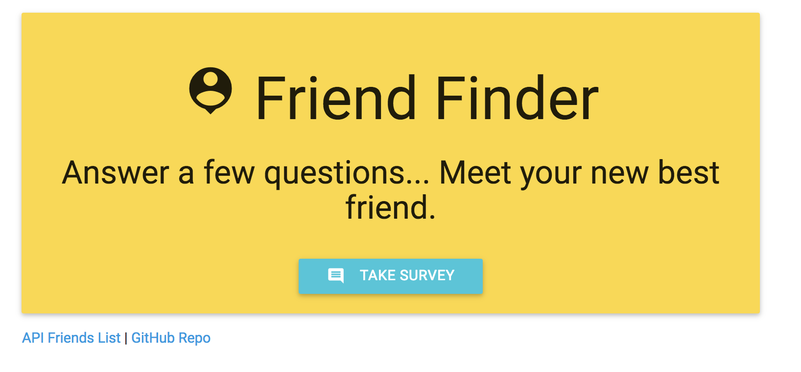
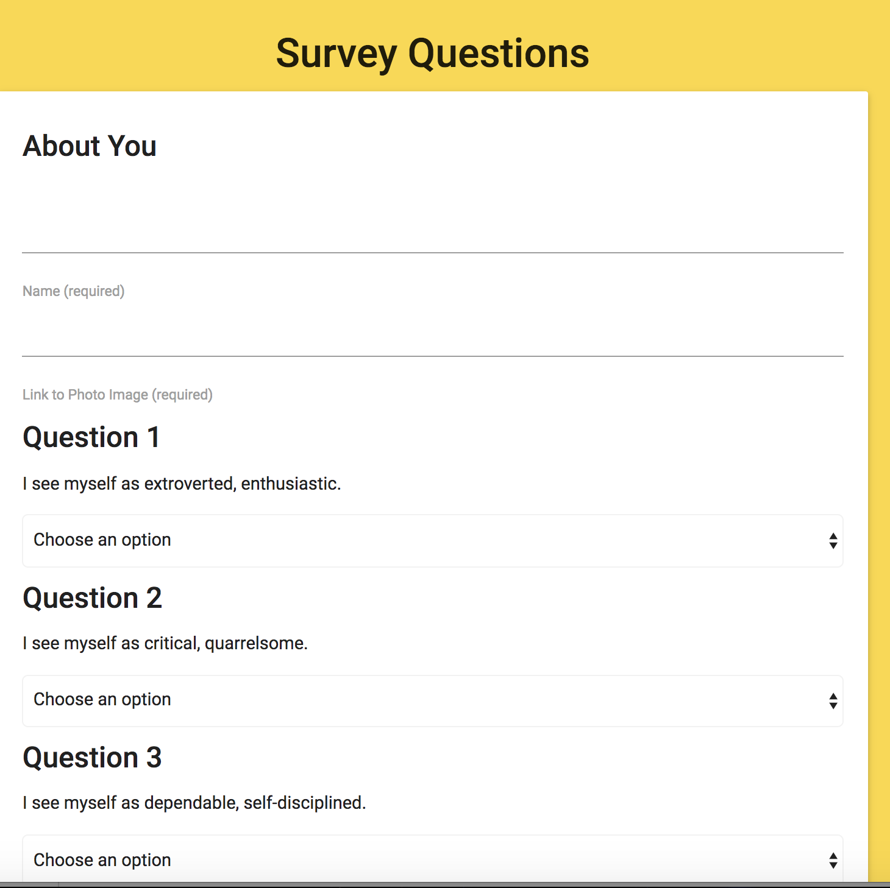

# FriendFinder
Created during Week 13 of UNH Coding Bootcamp. The goal was to create a Friend Finder app (essentially a dating app but for friends) using Node and Express servers. The user enters the page that leads to a survey. When the user submits the survey, they are matched with a "friend" that has the closest match to their personality.

##Getting Started
https://infinite-reaches-83072.herokuapp.com/

## Screen Shots


Index Page


Survey

## Technologies used
- Node.js
- body-parser NPM Package - https://www.npmjs.com/package/body-parser
- express NPM Package - https://www.npmjs.com/package/express
- path NPM Package - https://www.npmjs.com/package/path

### Prerequisites

```
- Node.js - Download the latest version of Node https://nodejs.org/en/
- Materialize - Add CDN link to HTML http://materializecss.com/getting-started.html
```

## Built With

* Sublime Text - Text Editor
* Materialize - Wireframe

## Authors

* **Mary Doucet** - *HTML/JS/Node.js* - [Mary Doucet](https://github.com/medoucet720)
